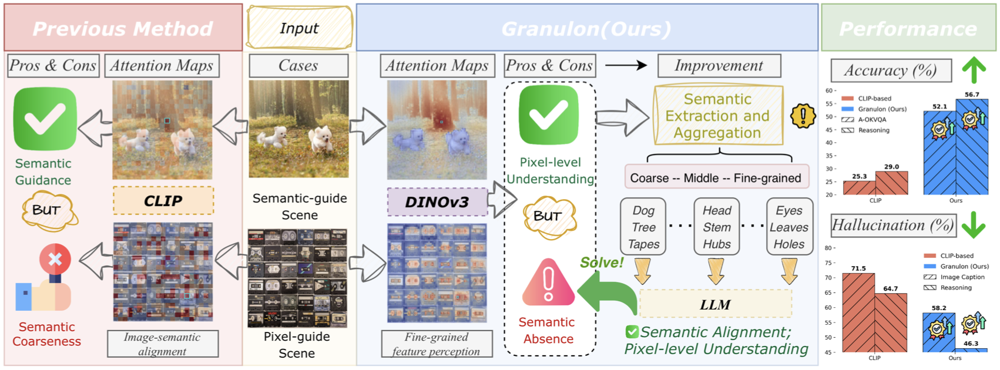
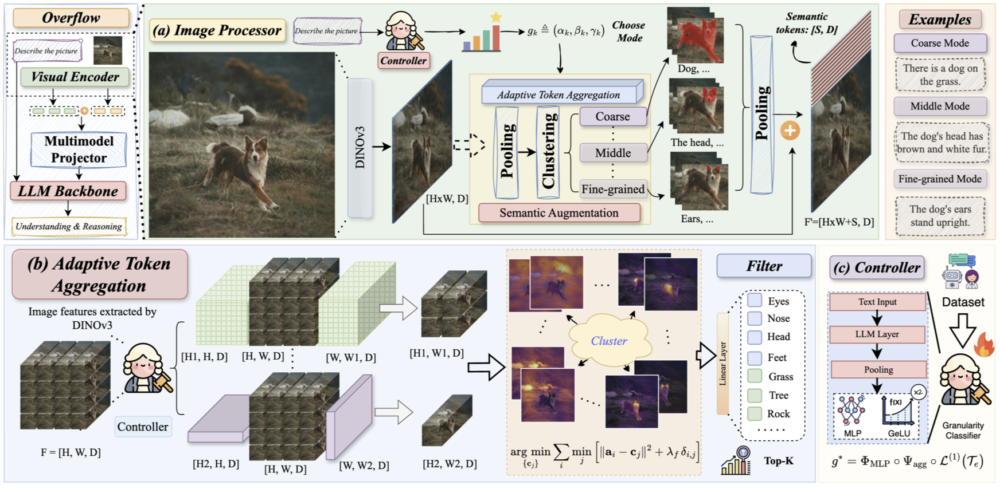

# Granulon: Awakening Pixel-Level Visual Encoders with Adaptive Multi-Granularity Semantics for MLLM

&nbsp;
&nbsp;

  <a href="https://arxiv.org/abs/2603.08800">
    Granulon: Awakening Pixel-Level Visual Encoders with Adaptive Multi-Granularity Semantics for MLLM
  </a>

  

    <strong>Awakening the potential of pixel-level visual encoders for MLLMs through adaptive multi-granularity semantic modeling</strong>
  

## Overview

Multimodal Large Language Models (MLLMs) have achieved remarkable success by leveraging CLIP-based visual encoders that provide strong global semantic alignment. However, these models often struggle with **fine-grained visual understanding** and pixel-level perception.

On the other hand, modern self-supervised visual encoders such as **DINOv3** exhibit powerful **pixel-level representation capability**, but they lack coarse-grained semantic abstraction that aligns well with language.

**Granulon** bridges this gap by introducing **adaptive multi-granularity semantics**, enabling pixel-level visual encoders to dynamically adjust their semantic abstraction levels according to the textual context.

---

## Motivation

<!-- MOTIVATION FIGURE -->

Existing multimodal visual encoders face a fundamental trade-off:

| Encoder Type | Strength | Limitation |
|---------------|----------|------------|
| CLIP-style encoders | Strong global semantic alignment | Weak pixel-level understanding |
| Self-supervised encoders (e.g., DINO) | Rich pixel-level features | Lack semantic abstraction |

MLLM reasoning often requires **multiple levels of visual granularity**, including:

- object-level semantics
- region-level relations
- fine-grained pixel perception

Granulon addresses this by enabling **adaptive visual granularity conditioned on text semantics**.

---

## Method Overview

<!-- METHOD PIPELINE -->

Granulon introduces a framework that augments pixel-level visual encoders with **adaptive semantic abstraction mechanisms**.

The framework mainly consists of two key components:

1. **Granularity Controller**
2. **Adaptive Token Aggregation**

Together, these modules dynamically organize visual tokens into semantically meaningful structures that align with language reasoning.

---

## Discussion

Granulon highlights the importance of **adaptive semantic abstraction** for multimodal perception.

Rather than relying solely on globally aligned encoders such as CLIP, enabling pixel-level encoders to **adaptively organize visual information** provides a promising direction for future multimodal models.

This paradigm suggests that **multi-granularity representation learning** may be a key ingredient for next-generation MLLMs.

---

## Citation

If you find this work useful, please consider citing:
